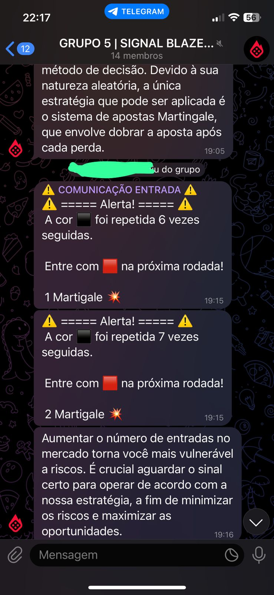

# Bot Blaze - Projeto Bot em Python

## Tecnologias Utilizadas

1. **Python**: O arquivo `bot.py` é escrito em Python e contém a lógica principal do bot. Ele faz chamadas de API usando a biblioteca `requests`.

2. **Docker**: O `Dockerfile` e `docker-compose.yaml` sugerem que o projeto usa contêineres Docker para isolamento de ambiente e implantação. A imagem base usada é Python 3.10.

3. **Shell Script**: O arquivo `install.sh` é um script shell que parece automatizar a instalação e configuração do projeto, especialmente em ambientes Linux/Unix. Ele também faz uma chamada de API para o Telegram.

4. **Arquivo de Requisitos**: `requirements.txt` lista todas as dependências Python necessárias para executar o projeto.

## Bot.py - Trecho de Código

### Visão Geral

O arquivo `bot.py` é o ponto principal de entrada para o bot, construído usando Python. Ele faz chamadas de API e contém a lógica principal.

### Tecnologias

- **Python**: Linguagem de programação usada.
- **Requests**: Biblioteca para fazer chamadas de API.

### Dependências

- `requests`: Para fazer chamadas de API.
- `python-dotenv`: Para gerenciar variáveis de ambiente.

## Docker e Docker Compose

O projeto usa Docker para facilitar o desenvolvimento, teste e implantação. O `Dockerfile` define como construir a imagem Docker, enquanto o `docker-compose.yaml` define como orquestrar os contêineres.

## Install.sh

Este script shell automatiza o processo de instalação e configuração. Ele também faz uma chamada de API para o Telegram para notificar sobre o início do bot.

## Como Executar

1. Clone o repositório.
2. Instale as dependências usando `pip install -r requirements.txt`.
3. Execute `docker-compose up` para iniciar os contêineres.
4. (Opcional) Execute `./install.sh` para automatizar ainda mais o processo.

## Arquivo bot.py

### O arquivo bot.py é um bot Python projetado para interagir com um jogo de roleta online. Ele faz o seguinte:

1. Busca dados do jogo de roleta: Utiliza a função fetch_data() para fazer uma chamada de API para "https://blaze.com/api/roulette_games/recent" e obter dados recentes do jogo.

2. Envia mensagens para o Telegram: Utiliza a função send_telegram_message(message) para enviar notificações e informações para um chat específico do Telegram.

3. Análise de cores da roleta: A função check_colors() analisa a sequência de cores resultantes do jogo de roleta e executa lógicas específicas com base nessa sequência.

### Funcionamento da Estratégia

- Início: Comece com uma aposta inicial mínima. Por exemplo, em uma mesa de roleta, você pode começar apostando $1 no vermelho ou preto.

- Apostas e Resultados: Se você ganhar, continue fazendo a mesma aposta mínima. Se perder, dobre a aposta na próxima rodada.

- Recuperação de Perdas: Ao dobrar a aposta após cada perda, a primeira vitória recuperará todas as perdas anteriores e ainda proporcionará um lucro igual à aposta inicial.

- Reinício: Após uma vitória, a estratégia é reiniciada, e a aposta retorna ao valor inicial.

### Exemplo
**Rodada 1**: Aposta $1 e perde. Perda total: $1.
**Rodada 2**: Aposta $2 e perde. Perda total: $3.
**Rodada 3**: Aposta $4 e ganha. Ganho: $4, Perda total: $3. Lucro líquido: $1.

### Riscos Associados
Embora a estratégia de Martingale pareça atraente devido à sua simplicidade e lógica aparente, ela é arriscada e pode levar a perdas significativas. Os principais riscos incluem:

**Limites de Mesa**: Muitos jogos têm um limite máximo de aposta, o que pode impedir a aplicação contínua da estratégia.

**Recursos Financeiros**: A estratégia exige um capital significativo para cobrir séries prolongadas de perdas.

**Retorno Limitado**: O lucro obtido após uma série de perdas é apenas igual à aposta inicial, o que pode não justificar o risco.

**Probabilidade**: A estratégia não altera as probabilidades do jogo; ela apenas tenta gerenciar as perdas.

## Regra Específica: Entrar após 5 Repetições na Cor Oposta
1. **Monitoramento**: O bot monitora continuamente os resultados da roleta, mantendo um registro das cores que aparecem (por exemplo, vermelho ou preto).

2. **Contagem de Repetições**: Quando o bot detecta que uma cor específica (por exemplo, vermelho) apareceu 5 vezes consecutivas, ele se prepara para agir.

3. **Entrada na Cor Oposta**: Após detectar a 5ª repetição da mesma cor, o bot envia uma mensagem (provavelmente para um chat do Telegram) indicando que é hora de entrar na cor oposta (neste caso, preto).

4. **Estratégia de Martingale**: Paralelamente, o bot aplica a estratégia de Martingale, dobrando a aposta após cada perda na cor oposta até que uma vitória seja alcançada.

5. **Reinício**: Uma vez que uma vitória é alcançada na cor oposta, o bot reinicia a contagem e a estratégia de Martingale, retornando à aposta inicial.

## Exemplo
1. A cor "vermelho" aparece 5 vezes consecutivamente.
2. O bot envia uma mensagem indicando que é hora de apostar no "preto".
3. Se a aposta no "preto" perder, o bot dobra a aposta no "preto" e continua até ganhar.
4. Uma vez que uma vitória é alcançada, a estratégia e a contagem são reiniciadas.

()

